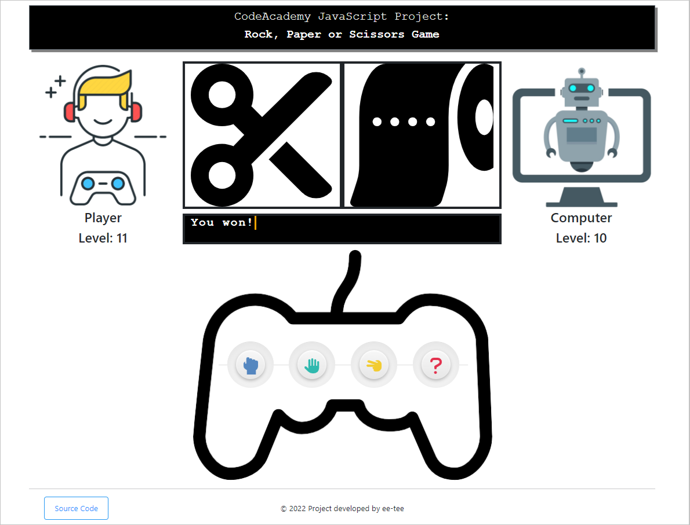
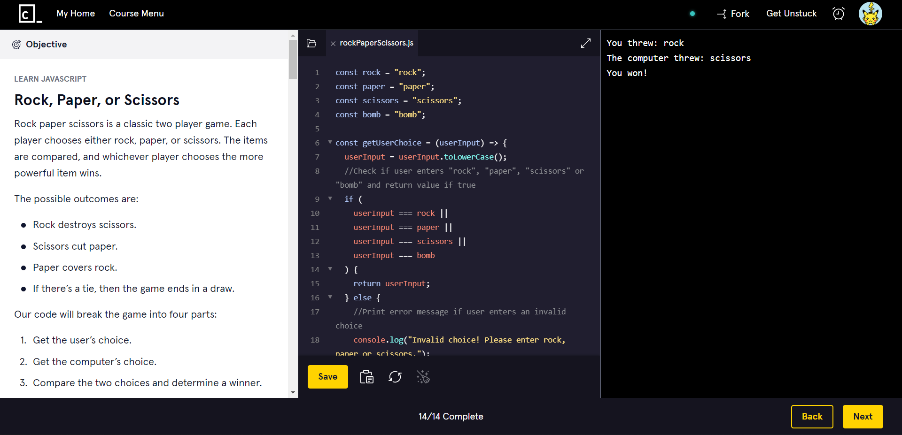

# rock-paper-scissors-game
<b>CodeAcademy JavaScript Project: Rock, Paper, or Scissors</b>

(From the course: Learn JavaScript)

Description:  
Rock paper scissors is a classic two player game. Each player chooses either rock, paper, or scissors. The items are compared, and whichever player chooses the more powerful item wins. The possible outcomes are:  
- Rock destroys scissors.  
- Scissors cut paper.  
- Paper covers rock.  
- If there's a tie, then the game ends in a draw.  
- But wait... there's also a surprise waiting for you to discover! 

<em><u>Bonus Challenge:</u> Player and computer gets a level up everytime they win so let's see who can get to level 100 first. Ready, get set, GO!!! </em>😝

 

I like to write codes to build applications and make things move but I like to see them in action too. Thus after completing the Rock, Paper or Scissors JavaScript project on CodeAcademy, I decided to create a complete version that can be played on the browser.

Try out the game at the link below and I hope you will enjoy playing it too! (>‿◠)✌

 

Browser Version: <a href="https://ee-tee.github.io/rock-paper-scissors-game/">https://ee-tee.github.io/rock-paper-scissors-game/</a>

(rockpaperscissorsWeb.js)

 

Normal Version:

(rockpaperscissors.js)

